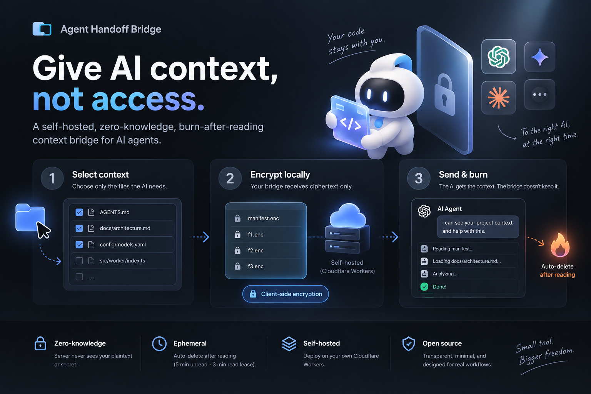

# agent-bridge (English index)



> **Give AI context, not access.**
> Self-hosted · Zero-knowledge · Burn after reading

A self-hosted, encrypted, burn-after-reading context bridge for ChatGPT,
Claude, Gemini, and other remote AI agents. Select a few files, encrypt them
locally, and paste a link + one-time password into any chat — the AI reads
your original files, then the bundle burns.

📚 **Full documentation: [README.md](./README.md) (Chinese)**
📄 **English reference: [docs/DOCUMENTATION.en.md](./docs/DOCUMENTATION.en.md)**

## How it works

1. **Select context** — choose only the files the AI needs.
2. **Encrypt locally** — browser/CLI AES-256-GCM; the bridge sees ciphertext only.
3. **Send & burn** — first read claims a 3-minute read lease, then the bundle burns.

## Quick start

```bash
git clone https://github.com/catinair/agent-bridge && cd agent-bridge
npm install
npm run setup      # wrangler login → KV → deploy → token → CLI config
npm link           # make `bridge` global
bridge push .ai/HANDOFF.md --copy
```

## Pointers

- CLI: `bridge push / check / config` — see the Chinese documentation, section 使用
- Agent API: `/v1/handoffs/:id` (+ `.txt` fallback, `/files/<objectId>.txt`, `/status`)
- Human page: `/h/:id` — decrypts locally, doubles as agent discovery
- Context Firewall: default-deny paths + credential scanning, fail closed

## License

MIT
